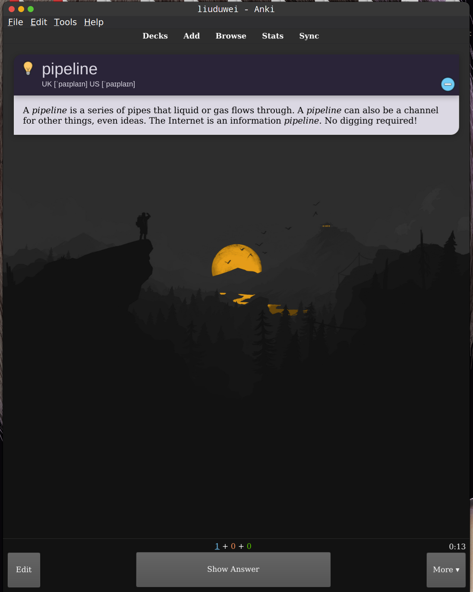
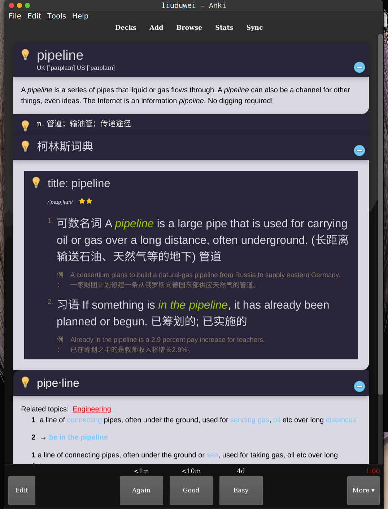
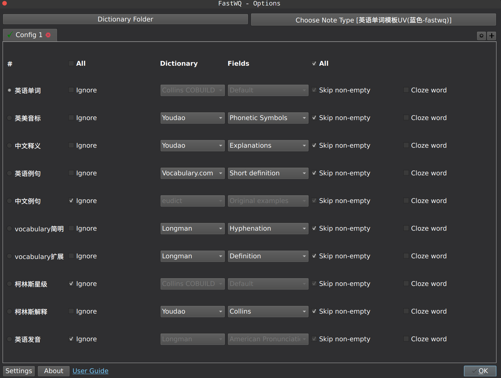

> 用 Anki 背单词好一段时间了,期间一直在探索如何优雅的批量制出质量不错的卡片，到现在为止，算是掌握了两种方法

## 方法一：通过开源项目 FastWq 制卡

> 项目地址[https://github.com/sth2018/FastWordQuery](https://github.com/sth2018/FastWordQuery)

#### 效果如下图：

#### 制卡方法:

1. **安装插件**

   请根据[项目](https://github.com/sth2018/FastWordQuery)ReadMe 文件安装，这里不再赘述.

2. **选择模板**

   使用插件查询需要先选定模板，模板选取自己喜欢的就好了，这里有两个个开源项目([1](https://github.com/ninja33/anki-templates),[2](https://github.com/Troyciv/anki-templates-superlist))收集了一些优秀模板，可以参考一下，注意的是有些模板的配色和查询结果的配色或者暗黑模式不兼容，需要自行修改一下模板的 html 或者 css 文件使得卡片字段一目了然

3. **插件配置**

   详细的使用教程 ReadMe 讲的很清楚了,但是这里再上补充一下：插件的有些选项是无效的，或者选项返回的结果很离谱.

   经过我的简单摸索，我自己的模板使用这个配置制作的卡片效果比较好:
   

## 方法二：通过 Excel 制作卡片

> 此方法是在知呼上看到的，点击链接跳转

需要补充的是，Excel 制卡文件只能在 windows 下用微软 Execl 打开，不支持 linux 下的 wps(win10 下的 wps 没测试过)

## 总结

1. Excel 制卡的方法很简单，基本开箱即用，一点都不需要额外的配置，但是缺点是比较麻烦，效率低

2. FastWq 配置起来比较麻烦，但是配置好过后效果非常好，支持本地字典查询模板字段自定义, 不需要任何第三方工具，方便且高效（也许 Execl 的法二改一改源代码也可以)

**希望之后还能找到更方便高效的方法，有时间甚至我都想自己写一个插件了，当然这都是后话了，我的当务之急是用好 Anki 这个神器考研冲冲冲**
