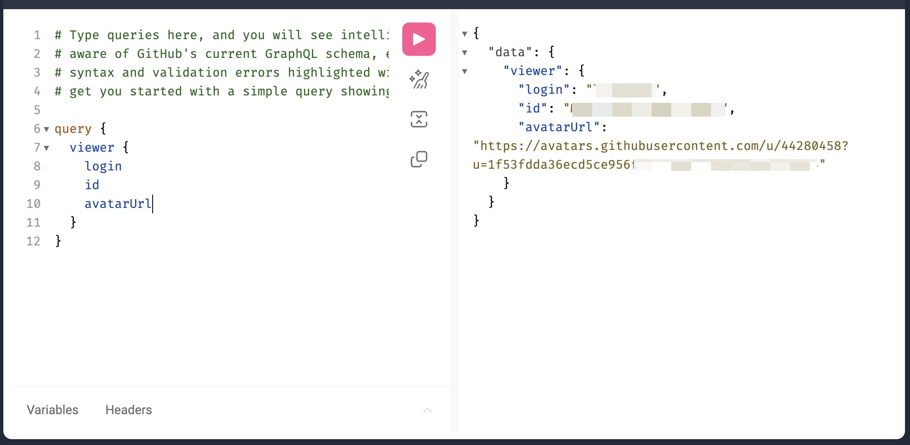

> I believe many newbie to web Developer have these questions, so  let's talk about it and fiugre out the exact details of these API Achitectures(or specifics)

## RPC (Remote Procedure Call)
> In distributed computing, a remote procedure call (RPC) is when a computer program causes a procedure (subroutine) to execute in a different address space (commonly on another computer on a shared network), which is written as if it were a normal (local) procedure call, without the programmer explicitly writing the details for the remote interaction. That is, the programmer writes essentially the same code whether the subroutine is local to the executing program, or remote. 
> ---Wikipedia

Actually RPC originally refers to communication in computer process, But in our context, RPC is a sytle of API design that focus the actions.
It can be confusing, let me explain. For example, if we want to fetch a movie list using the `Get` method with API address `api/getMovieList`, it's an RPC style API, it's an action that retrieves the movie list.

let's see some more RPC APIS:

```
// Add new product
POST /addProduct HTTP/1.1

HOST: api.example.com

Content-Type: application/json

{"name": "T-Shirt", "price": "22.00", "category": "Clothes"}

// get products
POST /getProduct HTTP/1.1

HOST: api.example.com

Content-Type: application/json

{"productID": "123”}

// update product
POST /updateProductPrice HTTP/1.1

HOST: api.example.com

Content-Type: application/json

{"productId": "123", "newPrice": "20.00"}

// delete product
POST /deleteProduct HTTP/1.1

HOST: api.example.com

Content-Type: application/json

{"productId": "123""}


// it's json-RPC, RPC also can implemented with XML, but 
// Nowdays, it's all about using json 
```

It's an action or a procedure that remotely calls the server's function to achive the goal.
We use `Get` when we fetch data, and in other case we use `Post` and put payload in the `body`.

## REST API (representational state transfer)
REST API have a lot of [Architectural constraints](https://en.wikipedia.org/wiki/REST), Here, I think the main concept of REST is resources.

First, let's look at these product APIs mentioned in chapter RPC but in RESTful:

```
// Add
POST /products HTTP/1.1

HOST: api.example.com

Content-Type: application/json

{"name": "T-Shirt", "price": "22.00", "category": "Clothes"}

// Get
GET /products/123 HTTP/1.1

HOST: api.example.com

// Updated 
PUT /products/123 HTTP/1.1

HOST: api.example.com

Content-Type: application/json

{"price": "20.00"}

// Delete
DELETE /products/123 HTTP/1.1

HOST: api.example.com
```

It treats product as a resource and use four http methods `GET | POST | PUT | DELETE` to perform CRUD oprations on it.

SO, if you know a URL  `api/product` provides REST API, you should know the corresponding CRUD API URLs.

But what about other situations apart from CRUD in our business logic, like starting, stopping, restarting a server? I think it's better use RPC API, REST is hard to describe those things,
it excels in CRUD operations on resources, but if you want describe other actions, you would need to spend a lot of time coming up with a REST API.

## GraphQL

it's a query language(syntax) via API call which originated in facebook, it's used specifically for querying data, with the data orginized in a hierarchical structure similar to a tree is better

```
query {
  viewer {
    login
    id
    avatarUrl
  }
}
```

this screenshot more clear


I have never worked with GraphQL before. However, i believe that if there a demend to fetch a large amount of structure Data, such as in a social Network, it would be better to use GraphQL.