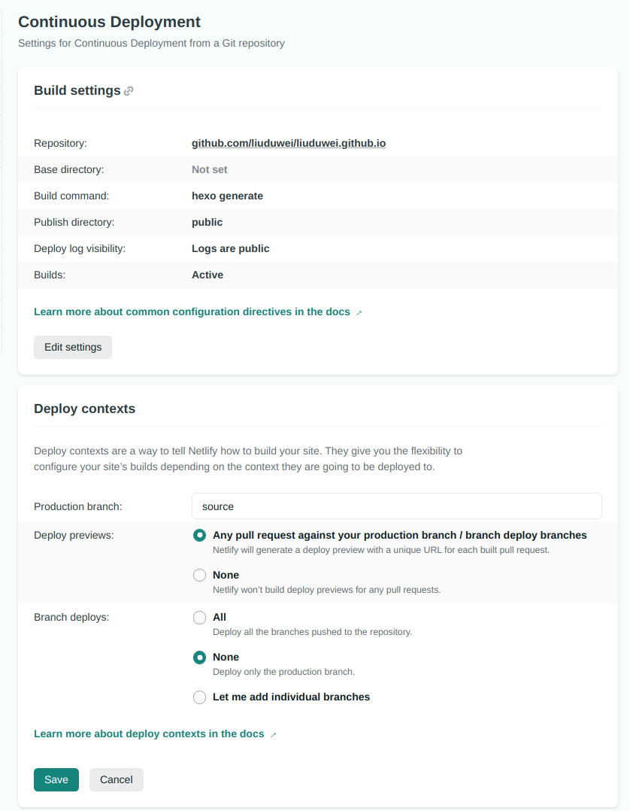
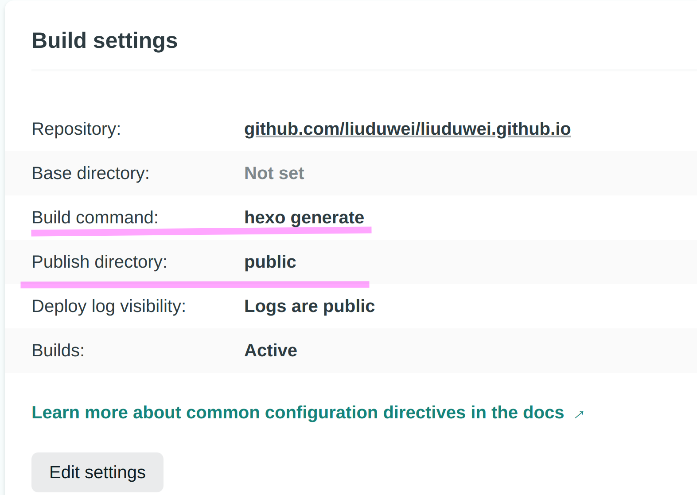
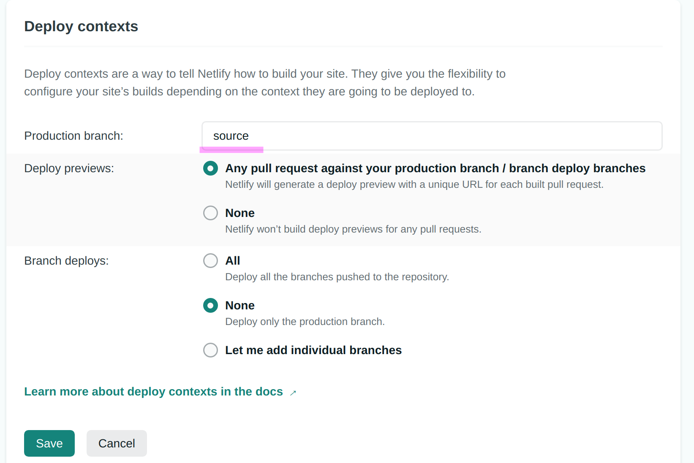
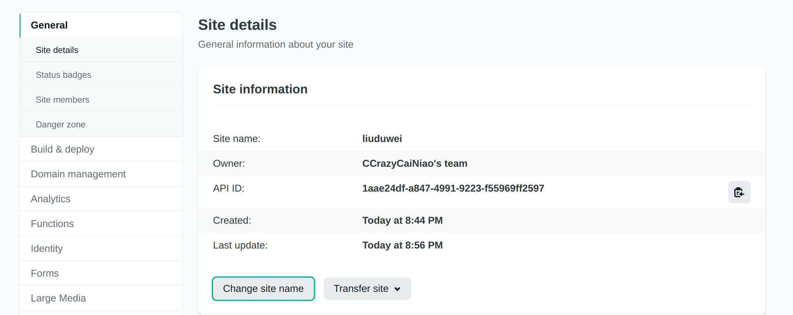

> GithubPages 在国内的访问速度实在太慢了，看了下 cdn 加速，要备案什么的太麻烦，于是找到了 Netlify 这个还算不错的解决方案（主要是免费 😏）

## 注册[Netlify](https://www.netlify.com)

第一个选项就是 Github 登录, 一路确认就好了

## 绑定仓库

Github 认证登录过后，右边应该有个 Site from git. 点击进去一路确认，选择你的 blog 源代码仓库. 没记错之后会自动跳到部署页面

## 部署

> 这一步稍微复杂一点点

1. 部署页面最下段会出现一个 build command 选项:

注意截图和第一次部署不一样

2.

- Hexo 选项如下:
  

- 注意这一项一定要填写 Hexo 源码所在的 branch:
  

3. 如果是静态网站甚至可以不用加 bulid 命令，另外还支持其他很多 Blog 框架的部署(请自行[阅读文档](https://docs.netlify.com/configure-builds/common-configurations/))

## 自定义二级域名

部署成功后会自动生成一个二级域名,但是前缀可以修改:

## 总结

测试了一下，不挂代理确实快很多，但是第一次图片还是加载的特别慢,但是比 github 随时 connect refused 好多了.

挂代理 github 快一些.
